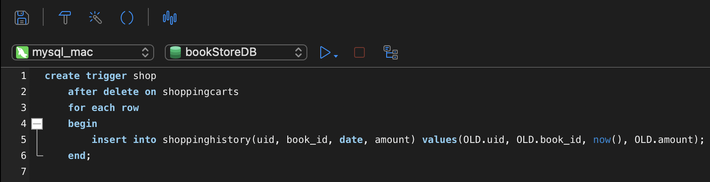
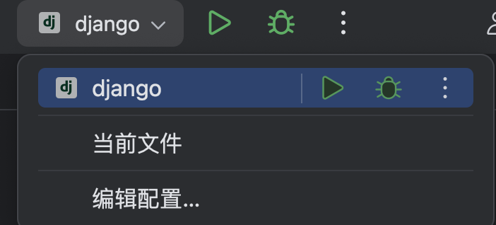
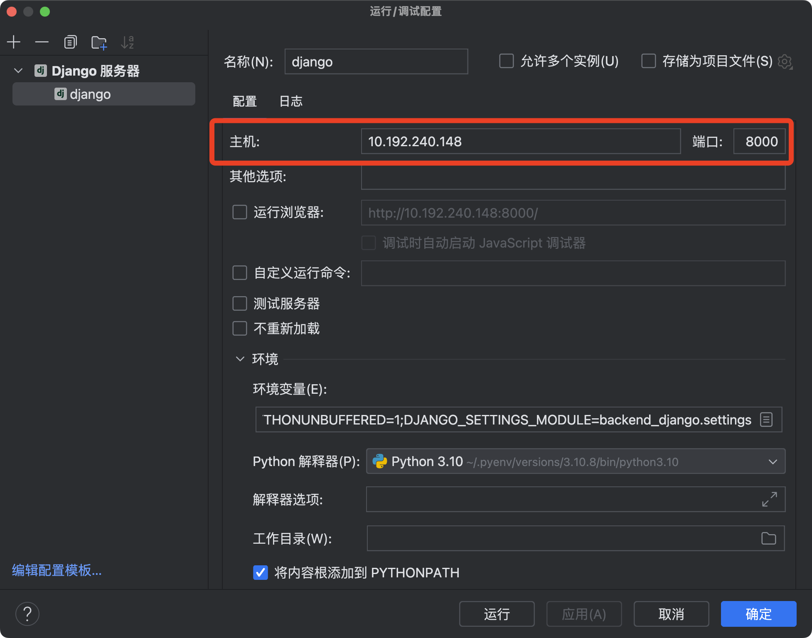
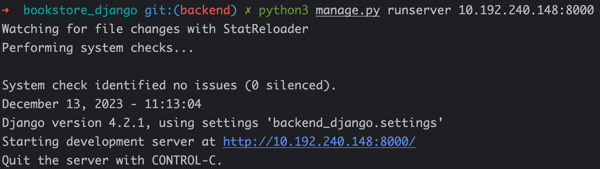

# README

## 后端项目Django结构

```
.
├── backend_django
│   ├── asgi.py
│   ├── settings.py
│   ├── urls.py
│   └── wsgi.py
├── bookStore
│   ├── migrations
│   ├── admin.py
│   ├── apps.py
│   ├── models.py
│   ├── serializers.py
│   ├── tests.py
│   ├── urls.py
│   └── views.py
├── django.json
├── manage.py
└── README.md
```

## 运行环境配置要求

### Python：3.10.8

### IDE：PyCharm 2023.2

### Django：4.2.1

### django rest framework：3.14.0

### coreapi：2.3.3

## 配置数据库

### 在mysql中创建数据库`bookStoreDB`

```shell
mysql -u root -p
# 输入密码
create database bookStoreDB；
```

## 配置Django中mysql相关设置

```python
# ./backend_django/settings.py
# Database
# https://docs.djangoproject.com/en/4.2/ref/settings/#databases
DATABASES = {
    'default': {
        'ENGINE': 'bookstore_django.db.backends.mysql',
        'HOST': '127.0.0.1',
        'PORT': '3306',
        'NAME': 'bookStoreDB',
        'USER': 'root',
        'PASSWORD': '[yourpasswd]',
    }
}
```

## 运行数据库迁移

```shell
python3 manage.py migrate
```

+ 该命令会在数据库bookStoreDB中创建各表（我们在[DBSEC2023-Lab3/mysql/SQL](../../mysql/SQL)中提供了创建schema和插入原始数据的SQL语句，但在项目构建中我们建议使用Django的数据库特性，使用其封装的api等进行数据库表的创建与数据导入）

## 导入原始数据

```shell
python3 manage.py loaddata ./django.json 
```

+ 我们使用Django原生命令`dumpdata`将数据库中的数据导出为Django可用的json文件

## 创建触发器

+ 由于Django并未提供原生的触发器机制（虽然有信号机制可以替代），但经测试，使用mysql原生触发器语句进行创建并为与Django发生冲突，故触发器`删除购物车后自动添加历史记录`功能需要运行原生SQL [trigger](../../mysql/SQL/script.sql)

+ 我们建议使用`Navicat/DataGrip`可视化工具运行该文件（也可以mysql命令行运行）

    

## 启动后端服务器

### 使用命令行

```shell
# DBSEC2023-Lab3/backEnd/bookstore_django
python3 manage.py runserver [[ip]:[port]]
```

+ #### windows系统下输入的可能是`python`

+ #### `[[ip]:[port]]`用于将**服务器启动**在指定ip和port下，默认为`localhost:8000`

+ #### 由于前后端分离的架构，应将其指定为运行主机的局域网ip上，查看ip方法如下

    ##### *nix：

    ```shell
    ifconfig getifaddr en0
    ```

    ##### windows：

    ```shell
    ipconfig
    ```

### 使用PyCharm

#### 在IDE右上角进行项目配置



#### 可以设置主机IP与端口



### 服务器启动成功

