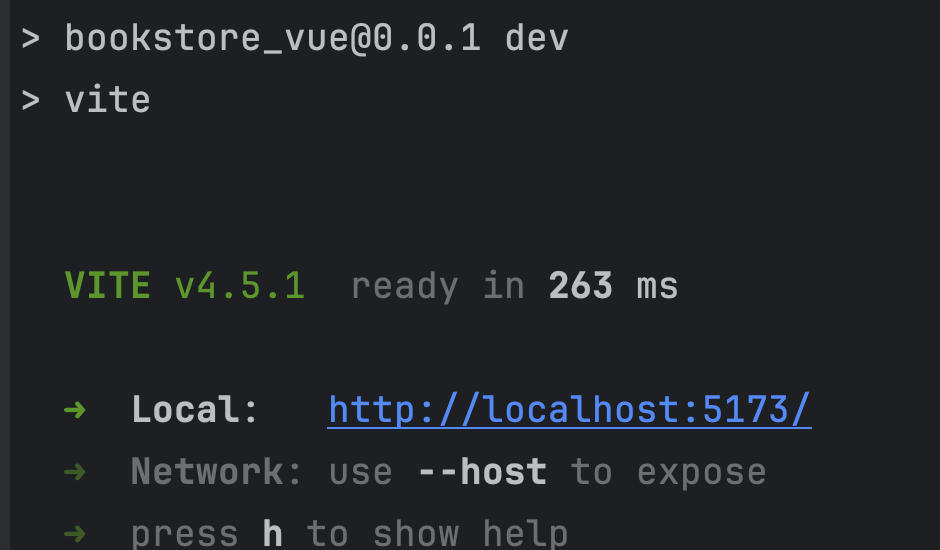

# foreEnd README

### 前端基于Vue+Typescript+Vite开发，为用户提供线上书店的实用性页面

## 开发环境

+ 操作系统：Windows11（home）   
+ 环境配置：Nodejs-21.3.0，vue-2.9.6，npm-10.2.4
+ IDE：WebStorm 2023.2 

## 前端项目使用

### 安装依赖包

输入命令：  
```    shell
# bookstore_vue
npm install
```
### 项目运行

#### 在安好依赖包后，配置package.json： 

```sh
{
	...
	"scripts": {
		"dev": "vite --host $your_ipaddr",
		"build": "vue-tsc --noEmit && vite build",
		"serve": "vite preview"
	},
	...
}	
```

+ ##### 如果你是*nix：

    + 实际上先获取你主机ip，并将服务器启动在该ip上（package.json中可设置）

    ```sh
    vite --host $(ifconfig getifaddr en0)
    ```

+ ##### 如果你是windows，请在package.json中手动设置：

    ```sh
    vite --host $your_ipaddr
    ```
    
#### 启动前端服务器

``` shell
npm run dev
```

+ 服务器默认启动在IP:5173上，如果不进行上述配置则默认启动在localhost:5173

    

+ **由于校园网路由限制，前端服务器ip配置保证在BUAA-WiFI内！！！**

+ 浏览器访问前端页面：http://IP:5173 or http://localhost:5173/

    

### 项目打包（非必要）

在安好依赖包后，输入命令： 
```
 npm run build
```
## 项目目录结构介绍

### 项目主要结构图如下：

```
bookstore_vues
├── LICENSE # 前端项目license
├── README.md # 前端项目README
├── public
├── src
│   ├── App.vue
│   ├── api # 常用api
│   ├── assets
│   ├── components # 常用构件
│   ├── main.ts
│   ├── router # 路由配置
│   ├── store
│   ├── style.css
│   ├── utils # 基础服务
│   ├── views # 视图文件
│   └── vite-env.d.ts
├── index.html
├── package.json
├── tsconfig.json
└── vite.config.ts    
```
### bookstore_vues/src/

前端源码主文件夹，内包括页面组件以及前后端交互组件。具体见下。

#### api

```
api
├── index.ts
├── models.ts
└── services.ts
```

+ index.ts，自定义配置的axios组件，用于前端发起请求

+ sha256.js，哈希算法sha256的js实现，用于注册口令的哈希值生成
+ service.ts，自定义前端常用函数

### assets

+ assets文件夹为前端项目的静态资源，里面提供了可使用的css样式和图片Img资源。

### components

```
components
├── bookCard.vue
├── bookPopup.vue
└── header.vue
```

+ 前端页面的通用子组件，被调用后，可以供views文件夹内父组件使用（包括样式和方法）。

### router

+ index.ts，自定义路由配置，对前端所有页面路由进行了声明，便于全局使用。

### utils

```
utils
├── models.ts
└── request.ts
```

+ model.ts，构建前端常用模型接口

+ request.ts，构建axios函数，构建了通用的前后端交互接口函数，供页面组件调用。

### views

+ 前端的所有页面组件，每个vue单页面文件包括template（html）,css,ts三个部分，结合调用内容，构建具体的网页和处理函数。

+ 各组件与页面对应关系如下：

    |        组件         |              网页              |
    | :-----------------: | :----------------------------: |
    |      home.vue       |         线上书店的首页         |
    |     Basket.vue      | 购物车界面，可查看、删除、支付 |
    | AdvancedSearch.vue  | 高级搜索界面，可多条件查询书籍 |
    |   BookBrowser.vue   |      书籍浏览，含简单分类      |
    |      login.vue      |          用户登录界面          |
    |    register.vue     |          用户注册界面          |
    | usercollections.vue |         用户收藏夹页面         |
    |    UserInfo.vue     |          个人中心页面          |

## 其他文件

+  package.json主要用于运行配置，例如修改前端服务器启动ip       
+ components.d.ts用于声明前端的一些组件，便于其它文件调用        
+ 其余为一些环境配置文件，不做过多介绍